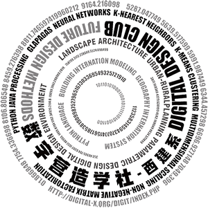

# Urban spatial data analysis method——python language implementation
'Urban spatial data analysis method——python language implementation'(abbreviation: USDAM_py) has been 1,039 days since the release of 'python knowledge graph(planning and design)' on August 4, 2017, to the sharing of the 49th experiment on June 8, 2020. About the urban spatial data analysis method of the research is endless, even if completed 50 trials, currently engaged in the study is still in production with a lot of code, part of the subject for urban space,  the latest research code will yet be issued share.  [first edition experiment](https://github.com/richieBao/python-urbanPlanning)。

 Finally is to complete the systematic work, according to the process of exploring the process of segmentation for three parts:

* First of all_the experimental exploration stage(currently basically completed)；

* Secondly_new comb, revise, adjust complement. Moreover the more critical part is setting up the online community to improve these experiments with everyone.；

* Thirdly_according to community feedback and expert opinions, the final revision is completed by professional reviewers under review.

After the previous experience of writing books, I realized that it also could not because of the work that brings confusion to readers. Readers could waste plenty of time making sense of all kinds of problems caused by authors, especially the code problem, which leads young people astray.   Authoring a book is going to have to think about the above things, and of course,  the time spent will also increase exponentially.  Therefore, in the process of writing 'USDAM_py,' a community is established to obtain feedback, check, revise and adjust continuously, and grow together with more learners and researchers.

In phase 2, the hope is that more partners will join in, rather than fighting alone as in stage 1. The author should also get divided into several items because of the process and requirements to be achieved.

|role      |      work     |  participant |
|:----------|:-------------|:------|
| author |  The subject who completes the work guarantees the completion of the book. | <em>Richie Bao(包瑞清)</em>  <em>Migel Santos</em>|
| chapter author | Partly or sporadically, contributing to the book.  | <em>Vacant Position</em> |
| illustrator | Hopefully, the book can have the style of Japanese manga, which makes people fall in love with learning, research, and life. | <em>Jing Li(李静)</em>  <em>Vacant Position</em>|
| translator | English language correction, revision review, without translation(the first translation by the author) | <em>Tao Xu(许韬)</em> <em>Migel Santos</em>|
| code tester | [Digital Construction Society](https://digit-x.github.io/digit_x/#/)，and a broader base of community partners | <em>Digital Construction Society(digit-x):Yuhui Wang(王育辉)、Hangyu Liu(刘航宇)、Xuyang Zhang(张旭阳)、Jinyu Chai(柴金玉)、Rengqi Dai(戴礽祁)、Baoping Xu(许保平)、Lipan Zhao(赵丽蟠)</em> |
|technical reviewer |responsible for code review and ensure code quality | <em>Vacant Position</em> |

***vacant position application，✉️：<em>richiebao@outlook.com</em>***

For the convenience of readers' study and research, the elaboration of this stage consists of three parts:
* [raw code.py file](https://github.com/richieBao/Urban-Spatial-Data-Analysis_python/tree/master/code)（spider interpreter,based on anaconda）；
* [easy to learn, interactive .ipynd file](https://github.com/richieBao/Urban-Spatial-Data-Analysis_python/tree/master/notebook)（with JupyterLab or Notebook to achieve）；
* [a document used for written exposition.md file](https://github.com/richieBao/Urban-Spatial-Data-Analysis_python/tree/master/docs/markdown)（Visual Studio Code etc.）。

> Quote: If you use the project's code in your research
@caDesign{
    title={Urban spatial data analysis method——python language implementation},
    author={Richie Bao,},
    note={\url{https://richiebao.github.io/Urban-Spatial-Data-Analysis_python}},
    year={2020}
}

👀Follow Us：
🏠[caDesign station](http://cadesign.cn/) QQ group:caDesign-79325664      💬 WeChat Service：<a href="url">    

