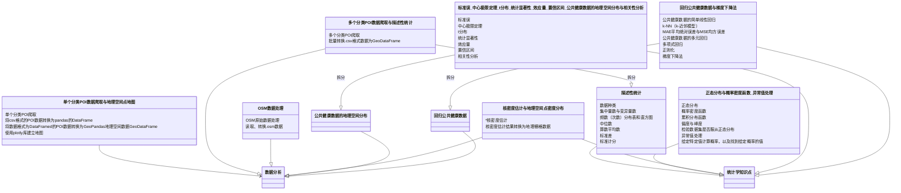
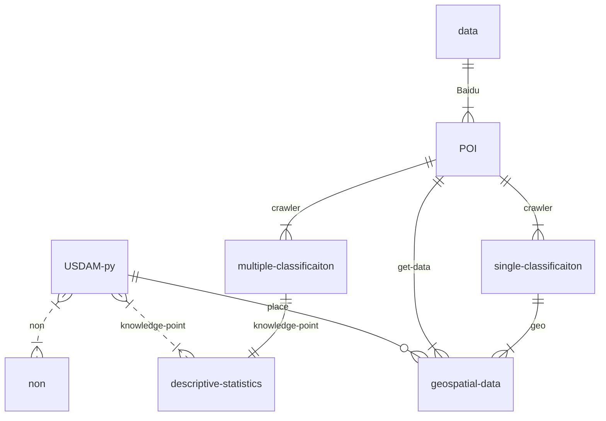

# Chapter structure thinking -- uncertainty
In line with people's learning habits, the book's chapter structure will make the learning process smooth. Still, it must be not one step in place in the writing process, but a constant adjustment and integration process, so I added this part to think about this problem.

### Knowledge point distribution

### Knowledge associated

