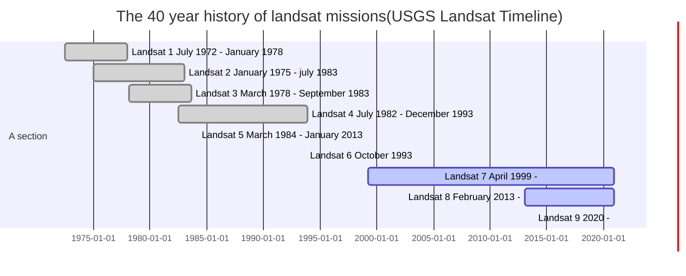

> Created on Tue Nov 26 20/21/48 2019  @author: Richie Bao-caDesign (cadesign.cn) __+updated on Fri Jul 31 10/59/55 2020 by Richie Bao

## 1. Landsat remote sensing image processing, digital elevation, principal component analysis
### 1.1 Landsat geographic information reading, cropping, merging, printing display
Since the 1970s, the Landsat series of satellites has provided almost non-stop medium-resolution multispectral remote sensing images of the global earth's surface. Uninterrupted data records, to enhance the application potential of data analysis, can help researchers in the growing population, urban development, the attention of food, water, forests, and other natural resources. The application of its unparalleled image quality, coverage, details analyzes the balance between the city's development and natural resources. [USGS-earthexplorer, United States Geological Survey](https://earthexplorer.usgs.gov/)).

> Note that the following mermaid diagram code cannot be displayed under JupyterLab, but appears under the usual markdown.


Data from Landsat resources satellites are multispectral and are collected from platforms mounted on space satellites orbiting the earth. The bands of remote sensing image data obtained by each satellite sensor are different. The following are the Landsat 8 bands:

| band  | wavelength range/nanometers  | spatial resolution/m  |spetral width/nm   |application   |
|---|---|---|---|---|
| Band 1- Coastal aerosol | 430 - 450  | 30  |20   |  Coastal and aerosol studies |
| Band 2- Blue  | 450 - 510  |  30 |  60 |  Bathymetric mapping, distinguish the soil from the vegetation,distinguish deciduous leaf from coniferous vegetation|
| Band 3- Green | 530 - 590  |  30 |  60 |Reflect vegetation growth peak, used to evaluate vegetation vitality  |
| Band 4- Red  | 640 - 670  |  30 |  30 | In the chlorophyll absorption zone, used for observing the road, bare soil, vegetation species, etc  |
| Band 5- Near Infrared(NIR)  | 850 - 880  | 30  | 30  | Emphasis on biomass and coastline  |
| Band 6- Shortwave Infrared 1(SWIR1)  |1570 - 1650   | 30  | 80  |Distinguish the moisture content of soil and vegetation, and can penetrate thin clouds  |
| Band 7- Shortwave Infrared 2(SWIR2)  | 2110 - 2290  |  30 |  180 |  Added, distinguish the moisture content of soil and vegetation, and can penetrate thin clouds |
| Band 8- Panchromatic  |500 - 680   | 15  | 180  | 15 m resolution, better image resolution  |
| Band 9- Cirrus clouds  | 1360 - 1380  | 30  | 20  | Improved detection of cirrus contamination  |
| Band 10- Thermal Infrared 1(TIRS_1)  | 10600 - 11190  | 100  | 590  | 100 m resolution, thermal infrared map, estimated soil moisture |
| Band 11- Thermal Infrared 2(TIRS_2)  | 11500 - 12510  | 100  | 1010 | 100 m resolution, added thermal infrared map, estimated soil moisture  |

Landsat series of remote sensing image is significant in the urban study and required for analysis in different research fields, for example, from the 1970s to the present, the evolution of the urban and natural environment, the change of land use types, inversion of surface temperature to study urban thermal environment, green space change and ecological impact, water resources and so on.   In addition to the Landsat medium resolution satellite, there are high-resolution remote sensing images with near-infrared bands, which can conduct in-depth vegetation research and expand related research on a micro-scale.

* The information contained in the Landsat file name

For example: LC08_L1TP_023031_20180310_20180320_01_T1

L=Landsat。 The case for L

X=sensor, “C” for OLI/TIRS combination, “O” for OLI, “T” for TIRS, “E” for ETM+, “T” for TM, “M” for MSS,  The case is C, which is OLI/TIRS combined sensor.

S=satellit. The case for the 08

[LLLL](https://www.usgs.gov/land-resources/nli/landsat/landsat-levels-processing)=Processing correction level，The thing is determined by ground control points, digital elevation, and data collected by sensors. “L1TP”(Precision Terrain) refers to level  1 precision terrain correction products; if the reference data is not sufficient, it is processed into systematic, terrain correction products: L1GT(Systematic Terrain) and L1GS(Systematic). The case for L1TP

PPP=WRS path  the Worldwide Reference, is the global positioning system for Landsat satellite data. We can specify a path, row to query satellite images of any part of the world. The case for 023

RRR=WRS row。 The case for 031

YYYYMMDD=get yaer。The case for 20180310

yyyymmdd=processing year。The case for 20180320

CC=collect number（01，02）。The case for 01

[TX](https://www.usgs.gov/land-resources/nli/landsat/landsat-collection-1?qt-science_support_page_related_con=1#qt-science_support_page_related_con)=the acquisition category("RT" for real time, "T1" for layer 1(Tier1) contains the highest data quality; "T2" is layer 2, because of missing data, the accuracy is lower than T1). The case for T1

For remote sensing image processing, namely, the processing of raster data, rasterio, earthpy, GDAL, and other libraries can be used to read and write, define or redefine the projection coordinate system, crop, merge, process, and visualize data, etc.

> References for this part
> 1. Cavin Hackeling. Mastering Machine Learning with scikit-learn[M].Packt Publishing Ltd.July 2017.Second published. 
2. Shin Takahashi, Iroha Inoue.The Manga Guide to Linear Algebra.No Starch Press; 1st Edition (May 1, 2012);


```python
import earthpy.spatial as es
import earthpy.plot as ep
import earthpy.mask as em
import matplotlib.pyplot as plt

from glob import glob
import os,re
plt.rcParams.update({'font.size': 20})

workspace=r"F:\data_02_Chicago\9_landsat\data_processing"
Landsat_fp={
        "w_180310":r"F:\data_02_Chicago\9_landsat\LC08_L1TP_023031_20180310_20180320_01_T1", #winter
        "s_190820":r"F:\data_02_Chicago\9_landsat\LC08_L1TP_023031_20190804_20190820_01_T1", #summer
        "a_191018":r"F:\data_02_Chicago\9_landsat\LC08_L1TP_023031_20191007_20191018_01_T1" #fall
        }
w_landsat=glob(os.path.join(Landsat_fp["w_180310"],"*_B[0-9]*.tif"))

band_name={'B1':'coastal_aerosol','B2':'blue','B3':'green','B4':'red','B5':'near_infrared','B6':'SWIR_1','B7':'SWIR_2','B8':'panchromatic','B9':'cirrus','B10':'TIRS_1','B11':'TIRS_2'}

def fp_sort(fp_list,str_pattern,prefix=""):
    '''
    function - Sort the list of files by the number in the file name
    
    Paras:
    fp_list - File list
    str_pattern - String matching pattern used to extract numbers from filenames
    prefix - The key name prefix of the dictionary data format
    
    return:
    fn_sort - Returns the sorted list
    fn_dict - Return a dictionary
    '''
    fn_num_extraction=[(int(re.findall(str_pattern, fn)[0]),fn) for fn in fp_list]
    fn_sort=sorted(fn_num_extraction)
    fn_dict=dict([("%s"%prefix+str(i[0]),i[1]) for i in fn_sort])
    return fn_sort,fn_dict
    
str_pattern=re.compile(r'B(.*?)[.]', re.S)  
fn_sort,fn_dict=fp_sort(w_landsat,str_pattern,prefix="B")    

#Print remote sensing image bands
array_stack, meta_data=es.stack([fn[1] for fn in fn_sort][:7], nodata=-9999)
ep.plot_bands(array_stack, title=list(band_name.values())[:7],cols=7,cbar=True,figsize=(10*7,10))
plt.show()
```


<a href=""></a>


Given the Landsat folder, the glob library is used to obtain all file paths of the specified string matching pattern, that is, each band of Landsat's path names, and then stack all bands into one variable using the Earthpy library. Note that only layers of the same spatial resolution can be overlapped, so the first seven bands are stacked, and the Earthly is used to show the results.  The following code defines the function `LandsatMTL_info(fp)`. Given the root directory where Landsat is located, it reads the metafile, namely _MTL.txt, obtains the relevant image information by reading this metafile, and obtains the path of each band.


```python
def LandsatMTL_info(fp):
    '''
    function - Read 'landsat *_MTL.txt' file and extract the required information.
    
    Paras:
    fp - Landsat file root directory
    
    return:
    band_fp_dic - Returns a path dictionary for each band
    Landsat_para - Returns the Landsat parameter 
    '''
    fps=[os.path.join(root,file) for root, dirs, files in os.walk(fp) for file in files] #Extract the path of all files under the folder
    MTLPattern=re.compile(r'_MTL.txt',re.S) #Match the object pattern and extract the remote sensing image metadata file _MTL.txt
    MTLFn=[fn for fn in fps if re.findall(MTLPattern,fn)][0]
    with open(MTLFn,'r') as f: #Read all metadata file information.
        MTLText=f.read()
    bandFn_Pattern=re.compile(r'FILE_NAME_BAND_[0-9]\d* = "(.*?)"\n',re.S)  #Landsat band file
    band_fn=re.findall(bandFn_Pattern,MTLText)
    band_fp=[[(re.findall(r'B[0-9]\d*',fn)[0], re.findall(r'.*?%s$'%fn,f)[0]) for f in fps if re.findall(r'.*?%s$'%fn,f)] for fn in band_fn] #(file name, file path)
    band_fp_dic={i[0][0]:i[0][1] for i in band_fp}
    #Extraction label of data /read metadata information as needed
    values_fields=["RADIANCE_ADD_BAND_10",
                   "RADIANCE_ADD_BAND_11",
                   "RADIANCE_MULT_BAND_10",
                   "RADIANCE_MULT_BAND_11",
                   "K1_CONSTANT_BAND_10",
                   "K2_CONSTANT_BAND_10",
                   "K1_CONSTANT_BAND_11",
                   "K2_CONSTANT_BAND_11",
                   "DATE_ACQUIRED",
                   "SCENE_CENTER_TIME",
                   "MAP_PROJECTION",
                   "DATUM",
                   "UTM_ZONE"]

    Landsat_para={field:re.findall(re.compile(r'%s = "*(.*?)"*\n'%field),MTLText)[0] for field in values_fields} #(parameter name, parameter value)
    return  band_fp_dic,Landsat_para #Returns all band paths and required parameter values

band_fp_dic,Landsat_para=LandsatMTL_info(Landsat_fp["w_180310"])
print(band_fp_dic)
print(Landsat_para)
```

    {'B1': 'F:\\data_02_Chicago\\9_landsat\\LC08_L1TP_023031_20180310_20180320_01_T1\\LC08_L1TP_023031_20180310_20180320_01_T1_B1.TIF', 'B2': 'F:\\data_02_Chicago\\9_landsat\\LC08_L1TP_023031_20180310_20180320_01_T1\\LC08_L1TP_023031_20180310_20180320_01_T1_B2.TIF', 'B3': 'F:\\data_02_Chicago\\9_landsat\\LC08_L1TP_023031_20180310_20180320_01_T1\\LC08_L1TP_023031_20180310_20180320_01_T1_B3.TIF', 'B4': 'F:\\data_02_Chicago\\9_landsat\\LC08_L1TP_023031_20180310_20180320_01_T1\\LC08_L1TP_023031_20180310_20180320_01_T1_B4.TIF', 'B5': 'F:\\data_02_Chicago\\9_landsat\\LC08_L1TP_023031_20180310_20180320_01_T1\\LC08_L1TP_023031_20180310_20180320_01_T1_B5.TIF', 'B6': 'F:\\data_02_Chicago\\9_landsat\\LC08_L1TP_023031_20180310_20180320_01_T1\\LC08_L1TP_023031_20180310_20180320_01_T1_B6.TIF', 'B7': 'F:\\data_02_Chicago\\9_landsat\\LC08_L1TP_023031_20180310_20180320_01_T1\\LC08_L1TP_023031_20180310_20180320_01_T1_B7.TIF', 'B8': 'F:\\data_02_Chicago\\9_landsat\\LC08_L1TP_023031_20180310_20180320_01_T1\\LC08_L1TP_023031_20180310_20180320_01_T1_B8.TIF', 'B9': 'F:\\data_02_Chicago\\9_landsat\\LC08_L1TP_023031_20180310_20180320_01_T1\\LC08_L1TP_023031_20180310_20180320_01_T1_B9.TIF', 'B10': 'F:\\data_02_Chicago\\9_landsat\\LC08_L1TP_023031_20180310_20180320_01_T1\\LC08_L1TP_023031_20180310_20180320_01_T1_B10.TIF', 'B11': 'F:\\data_02_Chicago\\9_landsat\\LC08_L1TP_023031_20180310_20180320_01_T1\\LC08_L1TP_023031_20180310_20180320_01_T1_B11.TIF'}
    {'RADIANCE_ADD_BAND_10': '0.10000', 'RADIANCE_ADD_BAND_11': '0.10000', 'RADIANCE_MULT_BAND_10': '3.3420E-04', 'RADIANCE_MULT_BAND_11': '3.3420E-04', 'K1_CONSTANT_BAND_10': '774.8853', 'K2_CONSTANT_BAND_10': '1321.0789', 'K1_CONSTANT_BAND_11': '480.8883', 'K2_CONSTANT_BAND_11': '1201.1442', 'DATE_ACQUIRED': '2018-03-10', 'SCENE_CENTER_TIME': '16:34:42.6511940Z', 'MAP_PROJECTION': 'UTM', 'DATUM': 'WGS84', 'UTM_ZONE': '16'}
    

The most basic information, including the projected coordinate system, WGS84，UTM_ZONE 16, can be obtained from the metadata. If you want to crop an image, the .shp boundary file's projection needs to be the same as the image.  The Rasterio library can read a Landsat band, directly obtain the projection coordinate system in CRS format to project or reproject the .shp boundary file. .crop_all provided by the Eathpy allows you to crop multiple bands, namely raster files, at once.


```python
import geopandas as gpd
from pyproj import CRS
import rasterio as rio

shape_polygon_fp=r'.\data\geoData\LandsatChicago_boundary.shp'
crop_bound=gpd.read_file(shape_polygon_fp)

#Obtain the Landsat remote sensing image's projection coordinate system for the .shp cropping boundary file to maintain the consistent projection and correct cropping.
with rio.open(band_fp_dic['B1']) as raster_crs:
    crop_raster_profile=raster_crs.profile
    crop_bound_utm16N=crop_bound.to_crs(crop_raster_profile["crs"])
print(crop_bound_utm16N.crs)

output_dir=os.path.join(workspace,r"w_180310")
w_180310_band_paths_list=es.crop_all(band_fp_dic.values(), output_dir, crop_bound_utm16N, overwrite=True) #Perform crop on all bands
print("finished cropping...")
```

    PROJCS["WGS 84 / UTM zone 16N",GEOGCS["WGS 84",DATUM["WGS_1984",SPHEROID["WGS 84",6378137,298.257223563,AUTHORITY["EPSG","7030"]],AUTHORITY["EPSG","6326"]],PRIMEM["Greenwich",0,AUTHORITY["EPSG","8901"]],UNIT["degree",0.0174532925199433,AUTHORITY["EPSG","9122"]],AUTHORITY["EPSG","4326"]],PROJECTION["Transverse_Mercator"],PARAMETER["latitude_of_origin",0],PARAMETER["central_meridian",-87],PARAMETER["scale_factor",0.9996],PARAMETER["false_easting",500000],PARAMETER["false_northing",0],UNIT["metre",1,AUTHORITY["EPSG","9001"]],AXIS["Easting",EAST],AXIS["Northing",NORTH],AUTHORITY["EPSG","32616"]]
    finished cropping...
    

The cropped files are stacked under one variable, and any layer can be read directly through the index, which is convenient for multi-spectral remote sensing image management.


```python
w_180310_stack_fp=os.path.join(workspace,r"w_180310_stack.tif")
w_180310_array, w_180310_raster_prof=es.stack(w_180310_band_paths_list[:7], out_path=w_180310_stack_fp)
print("finished stacking...")
```

    finished stacking...
    

Different image bands can be combined to show in different ways, to facilitate the observation of  different purposes, which are as follows:

| R、G、B  | The main purpose  |
|---|---|
|  4、 3 、 2 Red、 Green 、 Blue | Natural true color  | 
| 7、 6 、 4  SWIR2、 SWIR1 、 Red|  City |
| 5、4、3  NIR、 Red 、 Green | Standard false-color image, vegetation  |
| 6、5、2  SWIR1、 NIR 、 Blue| Agriculture |
| 7、 6 、 5  SWIR2、 SWIR1 、 NIR|  Penetrating the atmosphere |
| 5、 6 、 2  NIR、 SWIR1 、 Blue|  Healthy vegetation |
|5、 6 、 4   NIR、 SWIR1 、 Red|Land/water |
| 7、 5 、 3  SWIR2、 NIR 、 Green|  The natural surface removed atmospheric effects  |
|7、 5 、 4  SWIR2、 NIR 、 Red |Short wave infrared  |
| 6、 5 、 4  SWIR1、 NIR 、 Red|Vegetation analysis  |


```python
from rasterio.plot import plotting_extent
extent=plotting_extent(w_180310_array[0],  w_180310_raster_prof["transform"])

plt.rcParams.update({'font.size': 12})
fig, axs = plt.subplots(1,2,figsize=(25, 12))
ep.plot_rgb(
    w_180310_array,
    rgb=[3,2,1],
    stretch=True,
    extent=extent,
    str_clip=0.5,
    title="w_180310_B4,B3,B2",
    ax=axs[0]
)

ep.plot_rgb(
    w_180310_array,
    rgb=[5,4,1], #4/3/2  5/4/1 The file corresponding band is band number minus 1.
    stretch=True,
    extent=extent,
    str_clip=0.5,
    title="w_180310_B6,B5,B2",
    ax=axs[1]
)

plt.show()
```


<a href=""></a>


### 1.2 Principal components，PCA
#### 1.2.1 Principal component analysis
For all bands except panchromatic, is there a way to reduce the information dimension of 10 bands to 1, retain the maximum amount of information, and then print RGB images together with the relevant bands? In machine learning, hundreds or even thousands of feature vectors are encountered as an explanatory variable input training model. Principal component analysis(PCA) is one of the techniques to reduce data dimensions. It can be used to compress data, reduce memory usage, and alleviate the processing capacity of CPU/GPU, explore datasets, and display and observe high-dimensional data in two or three dimensions.

> To understand this part of the knowledge, you need to understand the 'A code representation of the linear algebra basis' section to read this part better.

Principal component analysis(PCA) is a statistical analysis method to simplify datasets. **The orthogonal transformation** is used to perform the linear transformation on the observed values of a series of possibly correlated variables to project to the values of a series of linearly independent** variables called principal components. PCA is often used to reduce a dataset's dimension and preserve the feature that contributes the most to the dataset variance. PCA depends on the given data, and the accuracy of the data has a great influence on the analysis results. There are many versions for the interpretation of PCA, including monographs, textbooks, networks, and so on, while [PCA interpretaion](https://stats.stackexchange.com/questions/2691/making-sense-of-principal-component-analysis-eigenvectors-eigenvalues/140579#140579) with  GIF animation given by [amoeba](https://stats.stackexchange.com/users/28666/amoeba) is one of the easiest to understand, so based on it as the main structure, use python to implement. Here, for the convenience of explaining PCA, a random data set X is generated, which contains two features: two sets of explanatory variables. To make the two features of the data have a certain linear relationship, multiply the dataset by a transformation matrix `transformation= [[-0.6, -0.6], [-0.3, -0.9]]`. The distribution of linear transformation sees the linear mapping section.

The distribution of these feature points(respectively by a feature as the x coordinate, another as y coordinate), was drawn in the familiar two-dimensional Cartesian coordinate system(also called a rectangular coordinate system); the purpose is trying to find a straight line(new axis), and then, all the feature points were projected onto the straight line to construct a new feature defined by linear combination $w_{1} x+w_{2} y$, each line corresponds to a specific value of  $w_{1} $ and $w_{2} $. Then, among the following rotated lines, which projection point of the line can retain the original dataset feature's maximum information? First of all, The difference between the projection points on this line should be maximized; that is, the variance reflecting the distribution should be maximized. From the change in the figure below, we can observe the new feature, namely the red projection point(reconstructed from the original two features), variance change. When the line rotates to the blue axis v_n_j, the variance reaches its maximum, and the variation trend can be easily observed from the feature points distribution. This projection point is the first principal component if its variance is greater than the second axis; otherwise, it is the second principal component. The overall reconstruction error is measured by the root-mean-square distance between the feature points and the corresponding projection points, while the two axes of rotation are always perpendicular. The distance from the projection point to the feature point and the distance from the projection point to the original exactly form a right triangle with the distance from the feature point to the origin. Therefore, the reconstruction error measurement can be converted into the measurement of the projection point variance; that is, the higher the projection point's variance, the lower the error.


The new coordinate axis that maximizes the projection point's variance is derived from the covariance of the feature points. $\begin{bmatrix}0.36372533(x(i)|x(i)) & 0.55326727 (y(j)|x(i))\\0.55326727(x(i)|y(j)) & 1.10198785(y(j)|y(j)) \end{bmatrix} $, where $x(i)|x(i)$及$y(j)|y(j)$ is the variance of each feature itself; $y(j)|x(i)$和$x(i)|y(j)$ is the covariance between the features, and the values are the same.  The new coordinate system to be sought is to maximize the variance of the feature points projection to one of the axes in the new coordiante system, and then the projection variances to other axes are successive decrease, indicating that the variance between axes, namely, $y(j)|x(i)$ and $x(i)|y(j)$, approaches 0, the variance of the projection points on other axes is relatively small.  $\begin{bmatrix}3.11020298e-04(x(i)|x(i)) & -4.96686164e-18 (y(j)|x(i))\\-4.96686164e-18(x(i)|y(j)) & 2.73202237e+00(y(j)|y(j)) \end{bmatrix} $, This feature can also be observed from the calculation results, where only $y(j)|y(j)$ has the largest variance, and the others all tend to 0. The covariance between axes is basically 0, that is, there is basically no correlation. In other words, when the covariance is 0, it means that the two features are almost completely independent. To make the covariance be 0, the second axis(base) can only be selected in the orthogonal direction with the first aixs(base). Therefore, the two axes of the new coordiante system are orthogonal and perpendicular.

The above statement can be further extended to the dimensionality reduction problem on general dimensions. A set of N-dimensional feature vectors can be reduced to K-dimension, where $0<K<N$. Select the orthogonal base (new coordinate system or vector space) of K units(modulus is 1) to make the covariance between each feature is 0 after the original data is transformed to this set of the base, the variance of the feature is as large as possible. Under the constraint of orthogonality, take the base(axis) corresponding to the maximum K variances.

The eigenvectors and eigenvalues are calculated from the square matrix of the original eigenvalues covariance. The calculated unit eigenvector is the new axis's direction, and the eigenvalue is the axis length (relative to the unit's multiples of the original corresponding axis). As for why the eigenvectors and eigenvalues of the covariance matrix are obtained as the new coordinate system, it can be understood as assuming that the coordinate system axis of the original feature is expressed as $\vec i(x),\vec j(y)$, with a unit length of 1, all eigenvectors can be expressed as $\begin{cases}c_{11} i+ c_{12}j \\c_{21} i+ c_{22}j \\ \ldots \\ c_{n1} i+ c_{n2}j\end{cases}$, if the variance value is considered as a representative that can reflect the class feature distribution, then all eigenvectors can be simplified as $s_{1}i+ s_{2} j$, then the covariance matrix can be expressed as $\begin{bmatrix} s_{1}i & s_{-} j i \\ s_{-}i j & s_{2} j \end{bmatrix} $. The original coordinate system (vector space) can be expressed as $\begin{bmatrix}1*i & 0*j\\0*i& 1*j \end{bmatrix} = \begin{bmatrix}i & 0 \\0& j\end{bmatrix} $, and the new coordinate system can be expressed as $\begin{bmatrix} w_{1}i & 0 \\0 & w_{2} j \end{bmatrix} $. It can be observed that the covariance matrix is similar to the form of the new coordiante system. After diagonalization of the covariance matrix(that is, the elements other than diagonals are reduced to 0), the axis(base) of the new coordinate system can be obtained, diagonalization is to find the eigenvectors and eigen values. **(The interpretation of this paragraph is general and can be skimmed over.)**

* Variance and covariance

In the part of variance and covariance, the explanations of variance and covariance have been given. Variance is used to measure the distribution of a group of values, it is the square deviation average of each value and the mean value. The formula is as follows: $s^{2} = \frac{ \sum_{i=1}^n  ( X_{i}- \overline{X}  )^{2}  }{n-1} $；Covariance is a method used to measure the degree of distribution correlation between two variables of a column and a row. Its formula is: $cov(X,Y)= \frac{ \sum_{i=1}^n ( X_{i}-  \overline{x}  )( Y_{i} - \overline{y} ) }{n-1} $。

If the covariance is 0, the variables are not correlated; If it is not 0, the sign indicates positive and negative correlation. When it is positively correlated, one variable increases with the increase of another variable. It is a negative correlation; one variable increases with its mean value, the other variable decreases concerning its mean value. The covariance matrix(deviation matrix, or variance-covariance matrix) describes each pair of dimensional variables' covariance in a dataset. If the element $(i,j)$ represents the covariance of the data $i^{th} $dim and $j^{th} $ dim, a 3d covariance matrix formula is as follows: $C= \begin{bmatrix}cov( x_{1},x_{1} ) & cov( x_{1},x_{2} ) &cov( x_{1},x_{3} )\\cov( x_{2},x_{1} ) & cov( x_{2},x_{2} )&cov( x_{2},x_{3} ) \\  cov( x_{3},x_{1} ) & cov( x_{3},x_{2} )&cov( x_{3},x_{3} ) \end{bmatrix} $。The covariance is extended from two to four dimensions using the classic iris dataset, with each dimension being a feature. The covariance is calculated directly using libraries such as Numpy and Pandas.

* Discuss again eigenvalues and eigenvectors

For the formula $A \xi = \lambda \xi $, or expressed as $A \vec v = \lambda \vec v$, where under the effect of the transformation matrix $A$, the vector $ \xi $ or $\vec v$ only changes in scale to the original $\lambda$ times. The vector $ \xi $ or $\vec v$ is an eigenvector of $A$, and $\lambda$ is the corresponding eigenvalue, that is, a matrix multiplied by its eigenvector is equal to scaling the eigenvector. Eigenvectors and eigenvalues can only be derived from square matrices, and not all square matrices have eigenvectors and eigenvalues. If a matrix has eigenvectors and eigenvalues, it has eigenvectors and eigenvalues on each of its dimensions. The principal component of a matrix is the eigenvector of its covariance matrix. The eigenvector corresponding to the largest eigenvalue is the first principal component, the eigenvector corresponding to the second largest eigenvalue is the second principal component, and so on.


```python
%matplotlib inline
import numpy as np
from numpy import linalg as LA
import util
from sympy.vector.coordsysrect import CoordSys3D
from sympy.vector.vector import Vector, BaseVector
from sympy import pprint
import matplotlib.pyplot as plt
from IPython.display import HTML

fig, axs=plt.subplots(1,2,figsize=(25,12))
np.random.seed(42)

#Define the vector space C
C=CoordSys3D('C')
i, j, k = C.base_vectors()
v1_origin=Vector.zero

#Create a random dataset
n_samples=100
X=np.random.randn(100,2)
transformation= [[-0.6, -0.6], [-0.3, -0.9]]
X=np.dot(X, transformation)
axs[0].scatter(X[:,0],X[:,1],label='X')
axs[1].scatter(X[:,0],X[:,1],label='X')

#Calculate eigenvectors and eigenvalues
w,v=LA.eig(np.cov(X.T))
print("covariance:\n",np.cov(X.T))
print("eigenvalues:\n",w)
print("eigenvectors:\n",v)

#The eigenvalue is multiplied by the eigenvector and eigenvalue to obtain the new feature of the sample.
new_X=np.matmul(X,w*v)
print("new build fearure covariance:\n",np.cov(new_X.T))

#Set up a new coordinate axis based on the eigenvectors
v_n_i=v[0][0]*i+v[1][0]*j
v_n_j=v[0][1]*i+v[1][1]*j

def vector_plot_2d(ax_2d,C,origin_vector,vector,color='r',label='vector',width=0.022):
    '''
    funciton - Transform vector and matrix data formats in Sympy to Matplotlib printable data formats

    Paras:
    ax_2d - 2d subgraph of Matplotlib
    C - /coordinate_system - coordinate systems defined under the Sympy
    origin_vector - If it is a fixed vector, the vector's starting point is given(using the vector, which indicates the position from the coordinate origin). If it is a free vector, the starting point is set to the coordinate origin.
    vector - The vector to be printed
    color - Vector color
    label - Vector label
    arrow_length_ratio - Vector arrow size   
    '''
    origin_vector_matrix=origin_vector.to_matrix(C)
    x=origin_vector_matrix.row(0)[0]
    y=origin_vector_matrix.row(1)[0]

    vector_matrix=vector.to_matrix(C)
    u=vector_matrix.row(0)[0]
    v=vector_matrix.row(1)[0]

    ax_2d.quiver(float(x),float(y),float(u),float(v),color=color,label=label,width=width)

vector_plot_2d(axs[0],C,v1_origin,v_n_i,color='r',label='v_n_i',width=0.005)
vector_plot_2d(axs[0],C,v1_origin,v_n_j,color='b',label='v_n_j',width=0.005)

vector_plot_2d(axs[1],C,v1_origin,v_n_i,color='r',label='v_n_i',width=0.005)
vector_plot_2d(axs[1],C,v1_origin,v_n_j,color='b',label='v_n_j',width=0.005)

import matplotlib.animation
#Draw the axis of rotation and observe
def circle_lines(center,radius,division):    
    import math
    import numpy as np
    '''
    function - Given the center of the circle, the radius, the division number, and calculate the head and tail coordinates of all diameters.

    Para:
    center - Center of the circle
    radius - radius of the circle
    division - Division number

    return：

    '''    
    angles=np.linspace(0,2*np.pi,division)
    x=np.cos(angles)*radius
    y=np.sin(angles)*radius
    xy=np.array(list(zip(x,y)))    
    xy=xy+center
    
    #x_=np.cos(np.pi-angles)*radius
    #y_=np.sin(np.pi-angles)*radius
    x_=-x
    y_=-y
    xy_=np.array(list(zip(x_,y_)))
    xy_=xy_+center
    
    xy_head_tail=np.concatenate((xy,xy_),axis=1)
    return xy,xy_,xy_head_tail

center=(0,0)
radius=5
division=360
_,_,xy_head_tail=circle_lines(center,radius,division)

#The projection from a point to a line
def point_Proj2Line(line_endpts,point):
    import numpy as np
    '''
    function - Calculate the projection of a point in two dimensions onto a line
    
    Paras:
    line_endpts - the head and tail coordinates of a line
    point - The point to be projected
    
    return:
    P - projected point
    '''
    pts=np.array(point)
    Line_s=np.array(line_endpts[0])
    Line_e=np.array(line_endpts[1])
    
    n=Line_s - Line_e
    #n/=np.linalg.norm(n, 2)
    n_=n/np.linalg.norm(n, 2)
    
    P=Line_e + n_*np.dot(pts - Line_e, n_)
    #print("Projection points coordinates",P)    
    
    return P

line,=axs[0].plot([2, -2],[0,0], color = 'gray', linewidth = 1) #Axis 1 of rotation is initialized.
line_v,=axs[0].plot([0, 0],[2,-2], color = 'silver', linewidth = 1)#Axis 2 of rotation(perpendicular to axis 1) is initialized.

pts_proj_initial=np.array([point_Proj2Line(((2,0),(-2,0)),p) for p in X ]) #Calculate projection points
pts_proj=axs[0].scatter(pts_proj_initial[:,0],pts_proj_initial[:,1],c='r',label='project points') #Projection points initialization

var_text=axs[0].text(0.05, 0.8, '', transform=axs[0].transAxes) #Printed text initialization
var_template='the variance of the projected feature  = %.3f'

v_lines=axs[0].plot([pts_proj_initial[:,0],X[:,0]],[pts_proj_initial[:,1],X[:,1]], color = 'palegoldenrod',linewidth = 1) #Initialize vertical lines at feature points and projection points

#Subgraph update
def update(xy_head_tail):
    '''
    function - matplolib animation update method
    '''
    x,y,x_,y_=xy_head_tail[0], xy_head_tail[1],xy_head_tail[2],xy_head_tail[3]
    pts_p=np.array([point_Proj2Line(((x,y),(x_,y_)),p) for p in X ])
    
    line.set_data([x,x_],[y,y_])  
    line_v.set_data([-y/4,-y_/4],[x/4,x_/4])
    
    #if x*y<0:
        #line_v.set_data([-y/2,-y_/2],[x/2,x_/2])
    #else:
        #line_v.set_data([y/2,y_/2],[-x/2,-x_/2])
    
    pts_proj.set_offsets(pts_p)
    pts_proj_var=np.var(pts_p)
    
    var_text.set_text(var_template % (pts_proj_var))
    
    for i in range(pts_p.shape[0]):
        v_lines[i].set_data([pts_p[i][0],X[i][0]],[pts_p[i][1],X[i][1]])
        
    return line,

axs[0].legend()
axs[1].legend()
anima=matplotlib.animation.FuncAnimation(fig, update, frames=xy_head_tail, blit=True, interval=100)
HTML(anima.to_html5_video())
```

    covariance:
     [[0.36372533 0.55326727]
     [0.55326727 1.10198785]]
    eigenvalues:
     [0.06775316 1.39796002]
    eigenvectors:
     [[-0.88175912 -0.47169996]
     [ 0.47169996 -0.88175912]]
    new build fearure covariance:
     [[ 3.11020298e-04 -4.96686164e-18]
     [-4.96686164e-18  2.73202237e+00]]
    


<a href=""></a>


```python
#Save the animation as a .gif file
from matplotlib.animation import FuncAnimation, PillowWriter 
writer = PillowWriter(fps=25) 
anima.save(r"./imgs/pca.gif", writer=writer)
```

#### 1.2.2 Three dimensional PCA
When PCA is described above, it starts from two dimensions, which is convenient for observation. The following is an example of a classical iris dataset in machine learning, in which three features are extracted to illustrate the PCA dimensionality reduction of the three dimensions eigenvalues. Its basic process is the same as the two dimensions, only in the diagram analysis, combined with a three-dimensional graphic for better observation. We can use our understanding of 2 and 3 dimensions to construct high dimensional space that is easy to understand by imagination for higher dimensions. At present, there are many research achievements in the graphic study of the high dimensional space, and we can try to visualize the high dimensional space through this method.


```python
import numpy as np
import pandas as pd
import plotly.express as px
import matplotlib.pyplot as plt
import seaborn as sns
sns.set()

iris_df=px.data.iris()
feature_selection=["sepal_length","sepal_width","petal_width","species"]
COV_iris=iris_df[feature_selection].cov() #Let us start with three-dimension to facilitate printing and observation.["sepal_length","sepal_width","petal_length","petal_width"]
print("iris covariance",COV_iris)
f, ax = plt.subplots(figsize=(9,8))
sns.heatmap(COV_iris, annot=True, linewidths=.5, ax=ax)

fig=px.scatter_3d(iris_df, x='sepal_length', y='sepal_width', z='petal_width',color='species',width=1200, height=800) #symbol='species'
fig.show()
```

    iris covariance               sepal_length  sepal_width  petal_width
    sepal_length      0.685694    -0.039268     0.516904
    sepal_width      -0.039268     0.188004    -0.117981
    petal_width       0.516904    -0.117981     0.582414
    


    <matplotlib.axes._subplots.AxesSubplot at 0x14138167d08>


<a href=""></a>

<a href=""></a>


Print feature points, corresponding projection points, and their respective coordinate systems in 3d space. The first principal component is distributed along the N_i axis and has a large variance. While the other two axes' eigenvalues are small relative to the first axis, the variance of the projection points corresponding to the feature points on the 2 and 3 axes is small. Therefore, the first principal component retains the iris feature property well, achieving dimensionality reduction.


```python
from numpy import linalg as LA
import util
from sympy.vector.coordsysrect import CoordSys3D
from sympy.vector.vector import Vector, BaseVector
from sympy import pprint

COV_iris_array=COV_iris.to_numpy()
w,v=LA.eig(COV_iris_array)
print("eigenvalues:\n",w)
print("eigenvectors_normalized:\n",v)

iris_3Features=iris_df[feature_selection]
import pandas as pd
pd.options.mode.chained_assignment = None
species_colors={'setosa':'red', 'versicolor':'blue', 'virginica':'yellow'}
iris_3Features['color']=iris_3Features.species.apply(lambda row:species_colors[row])

fig, axs=plt.subplots(1,2,figsize=(25,12))
axs[0]=fig.add_subplot(1,2,1, projection='3d')
axs[1]=fig.add_subplot(1,2,2,projection='3d')
axs[0].scatter(iris_3Features.sepal_length,iris_3Features.sepal_width,iris_3Features.petal_width,c=iris_3Features.color,)

C=CoordSys3D('C')
i, j, k = C.base_vectors()
v1_origin=Vector.zero
util.vector_plot_3d(axs[0],C,v1_origin,2*i,color='salmon',label='C_i',arrow_length_ratio=0.1)
util.vector_plot_3d(axs[0],C,v1_origin,2*j,color='maroon',label='C_j',arrow_length_ratio=0.1)
util.vector_plot_3d(axs[0],C,v1_origin,2*k,color='sandybrown',label='C_k',arrow_length_ratio=0.1)

#Unit eigenvector * eigenvalue(multiple)
N_i_=w[0]*(v[0][0]*i+v[0][1]*j+v[0][2]*k)
N_j_=w[1]*(v[1][0]*i+v[1][1]*j+v[1][2]*k)
N_k_=w[2]*(v[2][0]*i+v[2][1]*j+v[2][2]*k)

#Unit eigenvector
N_i=v[0][0]*i+v[0][1]*j+v[0][2]*k
N_j=v[1][0]*i+v[1][1]*j+v[1][2]*k
N_k=v[2][0]*i+v[2][1]*j+v[2][2]*k
util.vector_plot_3d(axs[0],C,v1_origin,N_i,color='forestgreen',label='N_i:1st eigenvector',arrow_length_ratio=0.1)
util.vector_plot_3d(axs[0],C,v1_origin,N_j,color='limegreen',label='N_j:2nd eigenvector',arrow_length_ratio=0.1)
util.vector_plot_3d(axs[0],C,v1_origin,N_k,color='mediumaquamarine',label='N_k:3rd eigenvector',arrow_length_ratio=0.1)

util.vector_plot_3d(axs[1],C,v1_origin,N_i_,color='forestgreen',label='N_i:1st eigenvector',arrow_length_ratio=0.1)
util.vector_plot_3d(axs[1],C,v1_origin,N_j_,color='limegreen',label='N_j:2nd eigenvector',arrow_length_ratio=0.1)
util.vector_plot_3d(axs[1],C,v1_origin,N_k_,color='mediumaquamarine',label='N_k:3rd eigenvector',arrow_length_ratio=0.1)

# The eigenvalues map to vector space N of N_i,N_j,N_k
# Construct transformation matrix
N_f_matrix=N_i_.to_matrix(C)
for v in [N_j_,N_k_]:
    v_temp=v.to_matrix(C)
    N_f_matrix=N_f_matrix.col_insert(-1,v_temp)
print("Transformation matrix:")
pprint(N_f_matrix)

iris_mapping_N=np.matmul(iris_df[feature_selection[:3]].to_numpy(),N_f_matrix.T).astype(float) #Linear mapping
species_colors_={'setosa':'coral', 'versicolor':'lightblue', 'virginica':'wheat'}
iris_3Features['color_']=iris_3Features.species.apply(lambda row:species_colors_[row])
axs[0].scatter(iris_mapping_N[:,0],iris_mapping_N[:,1],iris_mapping_N[:,2],c=iris_3Features.color_,)
axs[1].scatter(iris_mapping_N[:,0],iris_mapping_N[:,1],iris_mapping_N[:,2],c=iris_3Features.color_,)

axs[0].legend()
axs[1].legend()
#ax.set_xlim3d(0,5)
#ax.set_ylim3d(0,5)
#ax.set_zlim3d(0,5)

axs[0].set(xlabel='sepal_length',ylabel='sepal_width',zlabel='petal_width')
axs[1].set(xlabel='sepal_length',ylabel='sepal_width',zlabel='petal_width')
axs[1].legend(loc='lower left', frameon=False)
axs[0].view_init(20,20)
axs[1].view_init(10,5)
plt.show()
```

    eigenvalues:
     [1.1655692  0.07718794 0.21335471]
    eigenvectors_normalized:
     [[-0.73255285  0.53278011  0.42368818]
     [ 0.11049104 -0.52110099  0.84631288]
     [-0.671683   -0.66678266 -0.32286659]]
    Transformation matrix:
    ⎡0.00852857583562477  -0.143306730789405   -0.853841046776279⎤
    ⎢                                                            ⎥
    ⎢-0.0402227130979333  -0.142261221144189   0.620992083779817 ⎥
    ⎢                                                            ⎥
    ⎣0.0653251494721517   -0.0688851077741475  0.493837898598557 ⎦
    


<a href=""></a>


```python
iris_df_N=pd.DataFrame(np.hstack((iris_mapping_N,iris_df.species.to_numpy().reshape(-1,1))),columns=["1st_eigenvector","2nd_eigenvector","3rd_eigenvector","species"])
fig=px.scatter_3d(iris_df_N, x='1st_eigenvector', y='2nd_eigenvector', z='3rd_eigenvector',color='species',width=1200, height=800) #symbol='species'
fig.show()
```

<a href=""></a>


Only the first and second principal components are retained, and the distribution of feature points (values) can be viewed through a two-dimensional chart. Due to the large variance, the response variables corresponding to each feature value(iris category) can be well separated. Similarly, by only printing the first principal component, the linear distribution results are also good at separating the response variables.


```python
#A - Dimension reduction - retaining the 1,2 principal components.
fig, axs=plt.subplots(1,2,figsize=(25,12))
iris_PCA_1st_2nd=np.matmul(iris_df[feature_selection[:3]].to_numpy(),np.array(N_f_matrix).astype(float)[0:2].T).astype(float) #Dimension reduction, the first two principal components
axs[0].scatter(iris_PCA_1st_2nd[:,0],iris_PCA_1st_2nd[:,1],c=iris_3Features.color_)
axs[0].set(xlabel='1st_eigenvector',ylabel='2nd_eigenvector',)

iris_PCA_1st=np.matmul(iris_df[feature_selection[:3]].to_numpy(),np.array(N_f_matrix).astype(float)[0:1].T).astype(float) #Dimension reduction, the first principal component
axs[1].scatter(iris_PCA_1st,np.zeros(iris_PCA_1st.shape),c=iris_3Features.color_)
axs[1].set(xlabel='1st_eigenvector',ylabel='y',)
plt.show()
```


<a href=""></a>


#### 1.2.3 PCA dimension reduction and RGB display of Landsat remote sensing image band
Reduce the first seven bands of Landsat dimensions to 1, print and compare PCA_1(the first principal component), Normalized Difference Vegetation Index(NDVI), and [PCA_1, NDVI, band_5] combination. NDVI can distinguish vegetation areas well, and water areas can also be better distinguished when combined with PCA, band5. As for which combination of bands or calculation between bands can better reflect which ground features, in addition to introducing the main functions of each band, there are also many computational exponential auxiliary interpretations. For example, NDVI, NDWI(Normalized Difference Water Index), NDBI(Normalized Difference Built-up Index), etc., the formulas are as follows: $NDVI= \frac{NIR-Red}{NIR+Red} $，$NDWI= \frac{NIR-SWIR}{NIR+SWIR} $，$NDBI= \frac{SWIR-NIR}{SWIR+NIR} $。


```python
from sklearn.decomposition import PCA
n_components=1
w_180310_band_reduced=PCA(n_components=n_components).fit_transform(w_180310_array.T.reshape(-1,w_180310_array.shape[0]))
print("finished PCA.")
w_180310_band_reduced_reshape=w_180310_band_reduced.reshape(w_180310_array.shape[2],w_180310_array.shape[1],n_components).T
```

    finished PCA.
    


```python
band_merge=np.concatenate((w_180310_array,w_180310_band_reduced_reshape),axis=0)

from rasterio.plot import plotting_extent
extent=plotting_extent(w_180310_array[0],  w_180310_raster_prof["transform"])

plt.rcParams.update({'font.size': 12})
fig, axs = plt.subplots(1,3,figsize=(25, 12))

axs[0].imshow(w_180310_band_reduced_reshape[0],cmap='flag') #'prism'
axs[0].set_title("PCA_1")

#To calculate NDVI
def NDVI(RED_band,NIR_band):
    '''
    function - Calculate the NDVI index
    
    Paras:
    RED_band - red band
    NIR_band - Near-infrared band
    '''
    RED_band=np.ma.masked_where(NIR_band+RED_band==0,RED_band)
    NDVI=(NIR_band-RED_band)/(NIR_band+RED_band)
    NDVI=NDVI.filled(-9999)
    print("!"+"_min:%f,max:%f"%(NDVI.min(),NDVI.max()))
    return NDVI

RED_band=w_180310_array[3]
NIR_band=w_180310_array[4]
w_180310_NDVI=NDVI(RED_band,NIR_band)

band_merge=np.concatenate((band_merge,np.expand_dims(w_180310_NDVI,axis=0)),axis=0)

axs[1].imshow(w_180310_NDVI,cmap='flag') 
axs[1].set_title("NDVI")

ep.plot_rgb(
    band_merge,
    rgb=[-1,-2,4], 
    stretch=True,
    extent=extent,
    str_clip=0.5,
    title="PCA_1,NDVI,band5",
    ax=axs[2]
)

plt.show()
```

    !_min:0.000000,max:15.654902
    


<a href=""></a>


### 1.3 Digital Elevation
Digital elevation model(DEM) data can be from [USGS-earthexplorer, United States Geological Survey](https://earthexplorer.usgs.gov/) to download. DEM data format is a raster(.tif), and its processing method is similar to Landsat remote sensing image processing method; that is, all raster data processing methods are the same.


```python
import os
import numpy as np
import matplotlib.pyplot as plt
import earthpy as et
import earthpy.spatial as es
import earthpy.plot as ep
import rasterio as rio
from rasterio.warp import calculate_default_transform, reproject, Resampling

DE_Chicago_fp=r"F:\data_02_Chicago\9_landsat\GMTED2010N30W090_075\30n090w_20101117_gmted_mea075.tif"
DEChicago_reprojecting_savePath=os.path.join(workspace,r"DE_Chicago.tif")
#Projection conversion, DEM, .tif raster data
dst_crs=crop_raster_profile["crs"]
with rio.open(DE_Chicago_fp) as src:
    transform, width, height = calculate_default_transform(src.crs, dst_crs, src.width, src.height, *src.bounds)
    kwargs = src.meta.copy()
    kwargs.update({
        'crs': dst_crs,
        'transform': transform,
        'width': width,
        'height': height
    })
    with rio.open(DEChicago_reprojecting_savePath, 'w', **kwargs) as dst:
        for i in range(1, src.count + 1):
            reproject(
                source=rio.band(src, i),
                destination=rio.band(dst, i),
                src_transform=src.transform,
                src_crs=src.crs,
                dst_transform=transform,
                dst_crs=dst_crs,
                resampling=Resampling.nearest)    
print("finished reprojecting...")
```

    finished reprojecting...
    


```python
# Crop DEM, .tif data
DE_Chicago=es.crop_all([DEChicago_reprojecting_savePath],workspace, crop_bound_utm16N, overwrite=True) #Perform crop on all bands
print("finished cropping...")
```

    finished cropping...
    


```python
DE_Chicago_tif=rio.open(DE_Chicago[0])

#DEM print
fig, axs=plt.subplots(1,2,figsize=(25,12))
dem=axs[0].imshow(DE_Chicago_tif.read(1),cmap='pink')
plt.colorbar(dem,fraction=0.0485, pad=0.04,ax=axs[0])

#Add hill shadow
hillshade=es.hillshade(DE_Chicago_tif.read(1),azimuth=210,altitude=10)
ep.plot_bands(hillshade, cbar=False, title="Hillshade made from DEM", figsize=(10, 6),ax=axs[1],cmap='terrain')
axs[1].imshow(hillshade, cmap="Greys", alpha=0.5)
plt.show()
```


<a href=""></a>


 ### 1.4 key point
 #### 1.4.1 data processing technique
 
 * Use Earthpy, Rasterio library, to process geographic raster data.
 
 * Print the dynamic chart using matplotlib.animation

#### 1.4.2 The newly created function tool

* function - Sort the list of files by the number in the file name, `fp_sort(fp_list,str_pattern,prefix="")`

* function - Read 'landsat *_MTL.txt' file and extract the required information. `LandsatMTL_info(fp)`

* funciton - Transform vector and matrix data formats in Sympy to Matplotlib printable data formats, `vector_plot_2d(ax_2d,C,origin_vector,vector,color='r',label='vector',width=0.022)`

* function - Given the center of the circle, the radius, the division number, and calculate the head and tail coordinates of all diameters. `circle_lines(center,radius,division)`

* function - Calculate the projection of a point in two dimensions onto a line, `point_Proj2Line(line_endpts,point)`

* function -  Calculate the NDVI index, `NDVI(RED_band,NIR_band)`

#### 1.4.3 The python libraries that are being imported


```python
import earthpy.spatial as es
import earthpy.plot as ep
import earthpy.mask as em

import plotly.express as px
import matplotlib.pyplot as plt
import seaborn as sns

import matplotlib.pyplot as plt
import matplotlib.animation
from matplotlib.animation import FuncAnimation, PillowWriter 

from glob import glob
import os,re
import math
import pandas as pd

import geopandas as gpd
from pyproj import CRS
import rasterio as rio
from rasterio.plot import plotting_extent
from rasterio.warp import calculate_default_transform, reproject, Resampling

import numpy as np
from numpy import linalg as LA

from sympy.vector.coordsysrect import CoordSys3D
from sympy.vector.vector import Vector, BaseVector
from sympy import pprint

from IPython.display import HTML

from sklearn.decomposition import PCA
```

#### 1.4.4 Reference
> 1. Cavin Hackeling. Mastering Machine Learning with scikit-learn[M].Packt Publishing Ltd.July 2017.Second published.
2. Shin Takahashi, Iroha Inoue.The Manga Guide to Linear Algebra.No Starch Press; 1st Edition (May 1, 2012);
